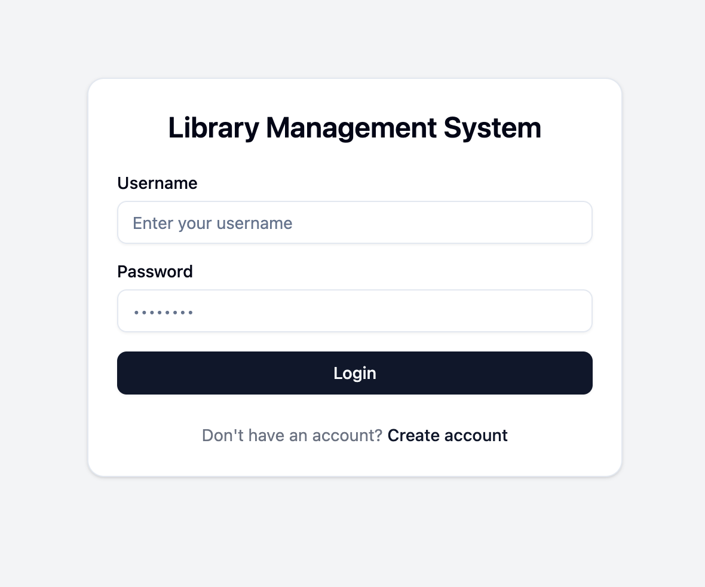
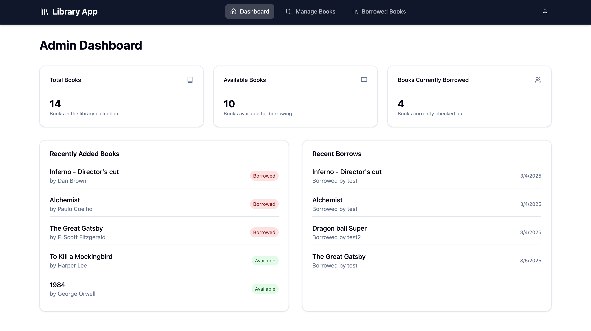
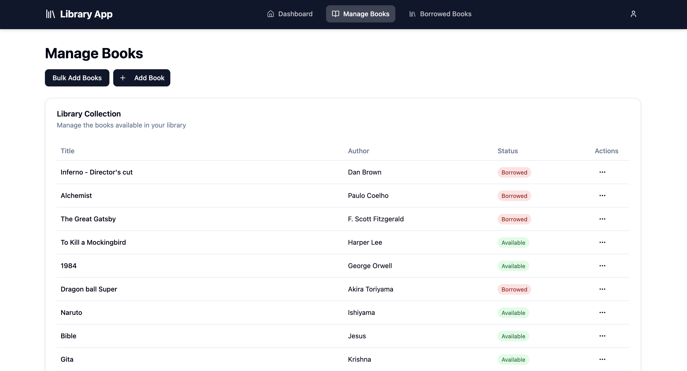
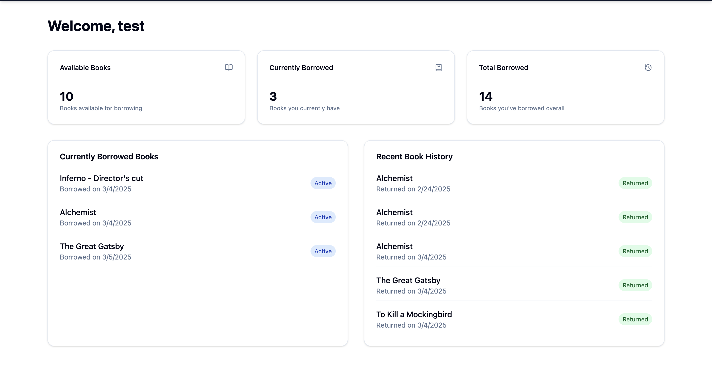
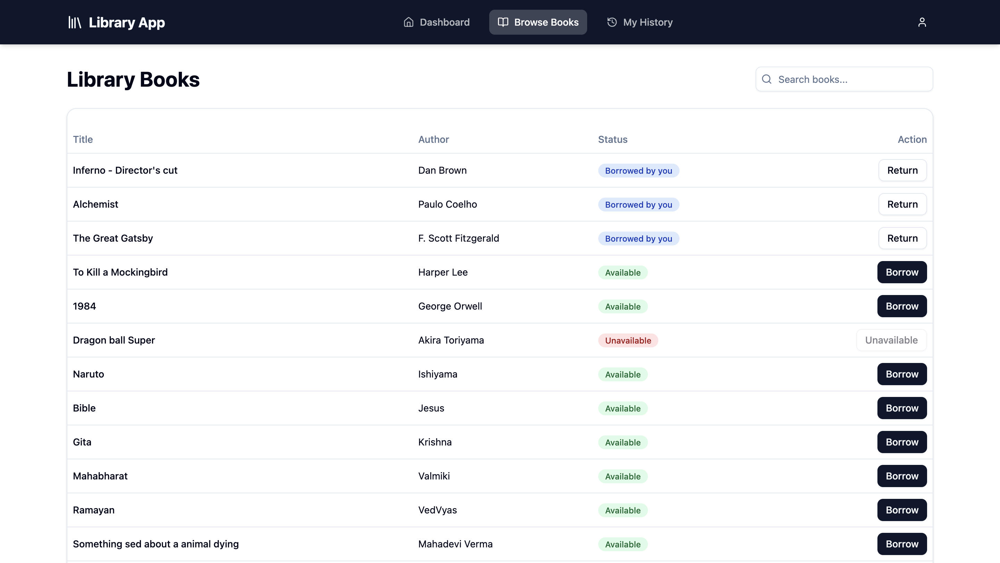
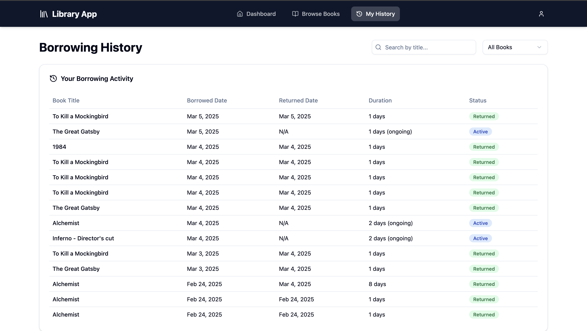

# 📚 Library Management System (Django + React)

This is a **full-stack Library Management System** built with:
- **Backend:** Django REST Framework (DRF) + JWT Authentication
- **Frontend:** React (Vite) + TypeScript + Redux Toolkit

## ✨ Features

### 🔹 **User Features**
✅ **JWT Authentication** (Login, Signup, Logout, Refresh Token)
✅ **Role-Based Access Control (RBAC)** for **Admin & Members**
✅ **Browse Books** (Search & Filter by Title, Author, Category, Availability)
✅ **Borrow & Return Books**
✅ **View Borrowing History** with timestamps
✅ **Secure Access** with protected routes in React

### 🔹 **Admin Features**
✅ **Manage Books** (Add, Update, Delete Books)
✅ **Track Borrowed Books** (Check who borrowed and when)
✅ **View Book Availability & Overdue Details**
✅ **Full Dashboard with Insights**

### 🔹 **Technical Features**
✅ **JWT Authentication with Token Refresh**
✅ **CORS Configuration for Secure API Calls**
✅ **Redux Toolkit for State Management**
✅ **API Testing with Postman**
✅ **Unit & Integration Tests** (Django Pytest & React Vitest)
✅ **TypeScript for Strong Typing & Scalability**

---
## 📂 Folder Structure

```
📁 library-management-system
│── 📁 backend               # Django Backend
│   ├── 📁 auth_api
│   │   ├── models.py
│   │   ├── serializers.py
│   │   ├── urls.py
│   │   ├── views.py
│   │
│   ├── 📁 library_api
│   │   ├── models.py
│   │   ├── permissions.py
│   │   ├── serializers.py
│   │   ├── urls.py
│   │   ├── views.py
│   │
│   ├── 📁 library_project
│   │   ├── settings.py
│   │   ├── urls.py
│   │   ├── wsgi.py
│   │
│   ├── 📁 tests
│   │   ├── test_auth.py
│   │   ├── test_library_api.py
│   │
│   ├── .env
│   ├── manage.py
│
│── 📁 frontend               # React + TypeScript Frontend (Vite)
│   ├── 📁 src
│   │   ├── 📁 components      # Reusable UI components
│   │   │   ├── Navbar.tsx
│   │   │   ├── PrivateRoute.tsx
│   │   │   ├── RoleRoute.tsx
│   │   │   ├── 📁 ui         # UI components from ShadCN
│   │   │   │   ├── button.tsx
│   │   │   │   ├── dropdown-menu.tsx
│   │   │   │   ├── input.tsx
│   │   │   │   ├── table.tsx
│   │   │   │   ├── alert.tsx
│   │   │
│   │   ├── 📁 pages          # Application pages
│   │   │   ├── Login.tsx
│   │   │   ├── Register.tsx
│   │   │   ├── Dashboard.tsx
│   │   │   ├── 📁 admin
│   │   │   │   ├── Books.tsx
│   │   │   │   ├── BorrowedBooks.tsx
│   │   │   │   ├── Dashboard.tsx
│   │   │   ├── 📁 member
│   │   │   │   ├── Books.tsx
│   │   │   │   ├── Dashboard.tsx
│   │   │   │   ├── History.tsx
│   │
│   │   ├── 📁 services      # API service calls
│   │   │   ├── api.ts
│   │   │   ├── authService.ts
│   │   │   ├── bookService.ts
│   │
│   │   ├── 📁 store         # Redux state management
│   │   │   ├── store.ts
│   │   │   ├── 📁 slices
│   │   │   │   ├── authSlice.ts
│   │
│   ├── README.md
│
│── package.json
```

---
## ⚙️ Environment Configuration

### 🔹 **Backend `.env` (Django)**
Create a `.env` file inside the **backend** directory.

```
# Security
SECRET_KEY=your-secret-key
DEBUG=True
ALLOWED_HOSTS=localhost,127.0.0.1

# Database settings
DB_ENGINE=django.db.backends.sqlite3
DB_NAME=db.sqlite3

# JWT settings
JWT_SIGNING_KEY=test
ACCESS_TOKEN_LIFETIME=60  # in minutes
REFRESH_TOKEN_LIFETIME=1  # in days

# CORS settings
CORS_ALLOWED_ORIGINS=http://localhost:5173,http://127.0.0.1:5173
CORS_ALLOW_CREDENTIALS=True
CORS_ALLOW_METHODS=GET,POST,PUT,PATCH,DELETE,OPTIONS
CORS_ALLOW_HEADERS=content-type,authorization,x-requested-with
```

---

### 🔹 **Frontend `.env` (React)**
Create a `.env` file inside the **frontend** directory.

```
# Base API URL
VITE_API_URL=http://localhost:8000/

# Enable credentials for CORS
VITE_WITH_CREDENTIALS=true
```

---
## 🚀 Installation & Setup

### **🔹 Backend Setup (Django)**
```bash
git clone https://github.com/anuj-consultadd/library_management.git
cd library-management/backend
python -m venv venv
source venv/bin/activate  # Mac/Linux
venv\Scripts\activate     # Windows
pip install -r requirements.txt
python manage.py migrate
python manage.py createsuperuser
python manage.py runserver
```

---

### **🔹 Frontend Setup (React)**
```bash
cd ../frontend
npm install
npm run dev
```

Frontend will be available at **http://localhost:5173/** 🎉  

---
## 📌 API Endpoints

### **Admin Endpoints**
| Method | Endpoint | Description |
|--------|---------|-------------|
| `POST` | `/admin/books/` | Add a book |
| `PUT` | `/admin/books/{id}/` | Update book details |
| `DELETE` | `/admin/books/{id}/` | Delete a book |
| `GET` | `/admin/books/` | View all books |

### **User Endpoints**
| Method | Endpoint | Description |
|--------|---------|-------------|
| `GET` | `/books/` | Browse books |
| `POST` | `/books/{id}/borrow/` | Borrow a book |
| `POST` | `/books/{id}/return/` | Return a book |

---

## preview:
`Login Page`


`Register Page`


`Admin Dashboard`


`Admin Book Info`


`Member Dashboard`


`Member Book Info`


`Member Book History`

